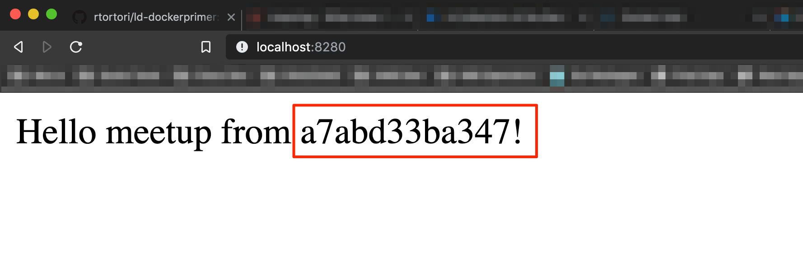

# 2. Learn and Do: Docker 102
#### A "Learn and do" series for people exploring Docker containers for the very first time 
###### Cisco Italy Multicloud Users Meetup
<hr>

#### Prerequisites

Prerequisites from [Docker primer Learn and Do](https://github.com/rtortori/ld-dockerprimer):

* Windows, MacOS or Linux
* [Install Virtualbox](https://www.virtualbox.org/wiki/Downloads)
* [Install Vagrant](https://www.vagrantup.com/downloads.html)
* [Install Git](https://git-scm.com/downloads)

Additional prerequisites for this Learn and Do:

* [Create a free account on Docker Hub](https://hub.docker.com)

#### Introduction

In the [first episode](https://github.com/rtortori/ld-dockerprimer) we had a quick bite at Docker containers:

1. We know that containers are not really existing in the host system but are a collection of OS features that allow to run processes and everything they depend on in a secure, isolated environment
2. Containers are instances of images. Images are a stack of filesystem differences, named layers, that together form the root filesystem for the instantiated container
3. Each layer can be compared to a transparent sheet of paper, where some information are impresses. If you stack them and have a look at the combined result, a meaningful image appears. Layers are reusable

We are going to run two labs in this Learn and Do:

1. Build container images
2. Container image structure

Let's get started. 
First things first: deploy the lab infrastructure like we did in [the Docker primer L&D](https://github.com/rtortori/ld-dockerprimer). It should take approximately 5 minutes:

```bash
vagrant up
```

#### Lab 1: Build container images (~25 minutes to complete)

On your machine ssh the developer VM:

```bash
vagrant ssh developer
```

Once you are in, download the required code to run this lab:

```bash
git clone https://github.com/rtortori/ld-docker102.git
```

<details>
<summary>Sample Output</summary>
<pre>
vagrant@developer-vm:~$ git clone https://github.com/rtortori/ld-docker102.git
Cloning into 'ld-docker102'...
remote: Enumerating objects: 9, done.
remote: Counting objects: 100% (9/9), done.
remote: Compressing objects: 100% (8/8), done.
remote: Total 9 (delta 0), reused 9 (delta 0), pack-reused 0
Unpacking objects: 100% (9/9), done.
</pre>
</details>

Change directory to ld-docker102/new_app and list the content:

```bash
cd ld-docker102/new_app && ls
```
<details>
<summary>Sample Output</summary>
<pre>
vagrant@developer-vm:~$ cd ld-docker102/new_app && ls
containers101.py  requirements.txt
</pre>
</details>

You will find two files, ```containers101.py``` is our sample application, it exposes a web page with the hostname of the host where the application is running.
The file ```requirements.txt``` contains the list of the dependiencies that MUST be installed before run the application.

Without going into the application details, you can run the application in the developer VM. 

First, install pip (Python package manager):

```bash
sudo apt install python3-pip -y
```

Then, install the application dependencies:

```bash
pip3 install -r requirements.txt
```

<details>
<summary>Sample Output</summary>
<pre>
vagrant@developer-vm:~/ld-docker102/new_app$ pip3 install -r requirements.txt
Collecting Flask==1.1.1 (from -r requirements.txt (line 1))
  Downloading https://files.pythonhosted.org/packages/9b/93/628509b8d5dc749656a9641f4caf13540e2cdec85276964ff8f43bbb1d3b/Flask-1.1.1-py2.py3-none-any.whl (94kB)
    100% |████████████████████████████████| 102kB 1.4MB/s
Collecting itsdangerous>=0.24 (from Flask==1.1.1->-r requirements.txt (line 1))
  Downloading https://files.pythonhosted.org/packages/76/ae/44b03b253d6fade317f32c24d100b3b35c2239807046a4c953c7b89fa49e/itsdangerous-1.1.0-py2.py3-none-any.whl
[...]
Successfully installed Flask-1.1.1 Jinja2-2.10.1 MarkupSafe-1.1.1 Werkzeug-0.16.0 click-7.0 itsdangerous-1.1.0
</pre>
</details>

Now, run the application:

```bash
python3 containers101.py
```

<details>
<summary>Sample Output</summary>
<pre>
vagrant@developer-vm:~/ld-docker102/new_app$ python3 containers101.py
 * Serving Flask app "containers101" (lazy loading)
 * Environment: production
   WARNING: This is a development server. Do not use it in a production deployment.
   Use a production WSGI server instead.
 * Debug mode: off
 * Running on http://0.0.0.0:5000/ (Press CTRL+C to quit)
</pre>
</details>

Open a browser and connect to ```http://localhost:8181```:


Nice, the app is running smoothly and we can see it runs in the 'developer-vm' as shown in the browser. However, you are running it as a process and you had to install the required dependencies in the host itself.

Let's containerize this application!
First of all, you need a 'Dockerfile', which is a special file that instructs Docker about how this container should be built.

In your terminal, hit CTRL+C to stop the running application:

```bash
[...]   
Use a production WSGI server instead.
 * Debug mode: off
 * Running on http://0.0.0.0:5000/ (Press CTRL+C to quit)
10.0.2.2 - - [29/Sep/2019 10:40:38] "GET / HTTP/1.1" 200 -
10.0.2.2 - - [29/Sep/2019 10:40:38] "GET /favicon.ico HTTP/1.1" 404 -
^C
```

Once you get back your prompt, run the following:

```bash
cat << EOF > Dockerfile
FROM python:3.7-alpine
COPY requirements.txt containers101.py /
RUN pip install -r requirements.txt
CMD python containers101.py
EOF
```

This command creates the Dockerfile. Each line represents one layer of our container image, as briefly described in the [Docker primer Learn and Do](https://github.com/rtortori/ld-dockerprimer).

Here are the instructions we specified in the Dockerfile:


| Parameter     | Meaning                                 |
| ------------- |-----------------------------------------|
| FROM          | This is the base image we want to start from. It's generally an OS image, in this case 'alpine OS', a lightweight OS with python 3.7 pre-installed                  |
| COPY          | We want to copy both requirements.txt and container101.py in the image, so we have everything we need in the container to run the application |
| RUN           | This is what we want to execute at build time. We want our requirements to be installed in order to have our application working                          |
| CMD           | This represents the command we want to execute once the container is started, in this case we want to run our container101.py application, like we did in the developer-vm a few minutes ago                  |

from the current directory in the developer-vm, run the following command to build the image:

```bash
docker build . -t meetup
```

<details>
<summary>Sample Output</summary>
<pre>
vagrant@developer-vm:~/ld-docker102/new_app$ docker build . -t meetup
Sending build context to Docker daemon  4.096kB
Step 1/4 : FROM python:3.7-alpine
3.7-alpine: Pulling from library/python
9d48c3bd43c5: Pull complete
c0ea575d71b9: Pull complete
0f535eceebd5: Pull complete
8a30f5893bea: Pull complete
c1d30ace7b67: Pull complete
Digest: sha256:9363cb46e52894a22ba87ebec0845d30f4c27efd6b907705ba9a27192b45e797
Status: Downloaded newer image for python:3.7-alpine
 ---> 39fb80313465
Step 2/4 : COPY requirements.txt containers101.py /
 ---> 33a867086756
Step 3/4 : RUN pip install -r requirements.txt
 ---> Running in be820689d326
Collecting Flask==1.1.1 (from -r requirements.txt (line 1))
  Downloading https://files.pythonhosted.org/packages/9b/93/628509b8d5dc749656a9641f4caf13540e2cdec85276964ff8f43bbb1d3b/Flask-1.1.1-py2.py3-none-any.whl (94kB)
Collecting click>=5.1 (from Flask==1.1.1->-r requirements.txt (line 1))
  Downloading https://files.pythonhosted.org/packages/fa/37/45185cb5abbc30d7257104c434fe0b07e5a195a6847506c074527aa599ec/Click-7.0-py2.py3-none-any.whl (81kB)
Collecting Werkzeug>=0.15 (from Flask==1.1.1->-r requirements.txt (line 1))
  Downloading https://files.pythonhosted.org/packages/ce/42/3aeda98f96e85fd26180534d36570e4d18108d62ae36f87694b476b83d6f/Werkzeug-0.16.0-py2.py3-none-any.whl (327kB)
Collecting itsdangerous>=0.24 (from Flask==1.1.1->-r requirements.txt (line 1))
  Downloading https://files.pythonhosted.org/packages/76/ae/44b03b253d6fade317f32c24d100b3b35c2239807046a4c953c7b89fa49e/itsdangerous-1.1.0-py2.py3-none-any.whl
Collecting Jinja2>=2.10.1 (from Flask==1.1.1->-r requirements.txt (line 1))
  Downloading https://files.pythonhosted.org/packages/1d/e7/fd8b501e7a6dfe492a433deb7b9d833d39ca74916fa8bc63dd1a4947a671/Jinja2-2.10.1-py2.py3-none-any.whl (124kB)
Collecting MarkupSafe>=0.23 (from Jinja2>=2.10.1->Flask==1.1.1->-r requirements.txt (line 1))
  Downloading https://files.pythonhosted.org/packages/b9/2e/64db92e53b86efccfaea71321f597fa2e1b2bd3853d8ce658568f7a13094/MarkupSafe-1.1.1.tar.gz
Building wheels for collected packages: MarkupSafe
  Building wheel for MarkupSafe (setup.py): started
  Building wheel for MarkupSafe (setup.py): finished with status 'done'
  Created wheel for MarkupSafe: filename=MarkupSafe-1.1.1-cp37-none-any.whl size=12629 sha256=f8cc724bb08d2e3b9fdc18e4197812f8747c4695bd0387538d3837148da9ad6c
  Stored in directory: /root/.cache/pip/wheels/f2/aa/04/0edf07a1b8a5f5f1aed7580fffb69ce8972edc16a505916a77
Successfully built MarkupSafe
Installing collected packages: click, Werkzeug, itsdangerous, MarkupSafe, Jinja2, Flask
Successfully installed Flask-1.1.1 Jinja2-2.10.1 MarkupSafe-1.1.1 Werkzeug-0.16.0 click-7.0 itsdangerous-1.1.0
Removing intermediate container be820689d326
 ---> d4c203e63b44
Step 4/4 : CMD python containers101.py
 ---> Running in 9a68c4a3e8f0
Removing intermediate container 9a68c4a3e8f0
 ---> 537e0bfbaa4e
Successfully built 537e0bfbaa4e
Successfully tagged meetup:latest
vagrant@developer-vm:~/ld-docker102/new_app$
</pre>
</details>

If we inspect the output, we see it goes through a 4-steps process:

1. Download python:3.7-alpine image
2. Copy requirements
3. Install requirements
4. Set ```python containers101.py``` as the command to start once the container is running

If we run the command ```docker image ls```, we can see our newly created image is in the local repository. We also see a second image, 'python:3.7-alpine', which is the base image we used to build our custom image:

```bash
docker image ls
```

<details>
<summary>Sample Output</summary>
<pre>
vagrant@developer-vm:~/ld-docker102/new_app$ docker image ls
REPOSITORY          TAG                 IMAGE ID            CREATED             SIZE
meetup              latest              537e0bfbaa4e        8 minutes ago       109MB
python              3.7-alpine          39fb80313465        4 weeks ago         98.7MB

</pre>
</details>

One of the most interesting features provided by Docker is [Docker Hub](https://hub.docker.com), a public image [registry](https://docs.docker.com/registry/) which allows users to upload and share docker images. On Docker Hub, you can also find official images from IT vendors, which are validated by Docker as genuine images.

Our 'meetup' image, has the default tag 'latest', however before we can upload it to Docker Hub, we need to apply additional tags, which will identify your user.
Replace 'rtortori' (my username on Docker) with your username:

```bash
docker tag meetup rtortori/meetup:latest
```

This command doesn't return any output. We now need to login to Docker Hub from the Docker engine (fill in with your username and password):

```bash
vagrant@developer-vm:~/ld-docker102/new_app$ docker login
Login with your Docker ID to push and pull images from Docker Hub. If you don't have a Docker ID, head over to https://hub.docker.com to create one.
Username: rtortori
Password:
WARNING! Your password will be stored unencrypted in /home/vagrant/.docker/config.json.
Configure a credential helper to remove this warning. See
https://docs.docker.com/engine/reference/commandline/login/#credentials-store

Login Succeeded
```

We successfully managed to login. Let's push our image. Depending on your internet connection speed, that might take some minutes. Again, replace with the right image tag:

```bash
docker push rtortori/meetup:latest
```
<details>
<summary>Sample Output</summary>
<pre>
vagrant@developer-vm:~/ld-docker102/new_app$ docker push rtortori/meetup:latest
The push refers to repository [docker.io/rtortori/meetup]
680c0e786b89: Pushed
120f42bfbfc9: Pushed
df8f08ee9463: Mounted from library/python
6a1aa47d6606: Mounted from library/python
7b66164940a3: Mounted from library/python
c5728f2d608b: Mounted from library/python
03901b4a2ea8: Mounted from library/python
latest: digest: sha256:fe218fee39fd2e0d3348e8dbfaab861dcac5583615dcf81b46ff609db057ad4c size: 1786
</pre>
</details>

Our containerized app image is now on Docker Hub, let's have a look in [Docker Hub](https://hub.docker.com):


Let's move now on the 'production-vm', this is a new VM we've never connected before. On your developer-vm terminal, type ```exit```. You will be back on your local machine.

Run the command:
```bash
vagrant ssh production
```
If you run the command ```docker version```, you can see that we have docker pre-installed, however we didn't downloaded our application or installed any dependencies.

Execute the following command to run our containerized application:

```bash
docker run -itd -p 5000:5000 rtortori/meetup
```

<details>
<summary>Sample Output</summary>
<pre>
vagrant@production-vm:~$ docker run -itd -p 5000:5000 rtortori/meetup
Unable to find image 'rtortori/meetup:latest' locally
latest: Pulling from rtortori/meetup
9d48c3bd43c5: Pull complete
c0ea575d71b9: Pull complete
0f535eceebd5: Pull complete
8a30f5893bea: Pull complete
c1d30ace7b67: Pull complete
117279abc1b2: Pull complete
4cd9dd4dff59: Pull complete
Digest: sha256:fe218fee39fd2e0d3348e8dbfaab861dcac5583615dcf81b46ff609db057ad4c
Status: Downloaded newer image for rtortori/meetup:latest
a7abd33ba3473efb33693ae7d134be4d8b811841a45b4115ea91d7001023cd0f
</pre>
</details>

Similar to the examples we saw in the [Docker primer Learn and Do](https://github.com/rtortori/ld-dockerprimer), we bound the application port (TCP/5000) to the local TCP port 5000. Vagrant has been configured to map those port to host port TCP 8280.

Open a web browser to ```http://localhost:8280```:



As we can see, the application runs in an OS with a 'strange' hostname :)<br>
This is the actual container hostname as you can see running the ```docker ps``` command:

```bash
docker ps
```

<details>
<summary>Sample Output</summary>
<pre>
vagrant@production-vm:~$ docker ps
CONTAINER ID        IMAGE               COMMAND                  CREATED             STATUS              PORTS                    NAMES
a7abd33ba347        rtortori/meetup     "/bin/sh -c 'python …"   5 minutes ago       Up 5 minutes        0.0.0.0:5000->5000/tcp   jolly_gould
</pre>
</details>

Our containerized app is running successfully in Docker on our 'production-vm' machine. We didn't have to install anything except Docker.

The image we prepared in the 'developer-vm' self-contains everything needed to run the application. This allows to run multiple applications (even using conflicting dependencies) in the same host, which can potentially never be touched in terms of library installations/updates, etc.

This concept is also known as [Immutable Infrastructure](https://highops.com/insights/immutable-infrastructure-what-is-it/).

This ends the first lab.


#### Lab 2: Container image structure (~20 minutes to complete)

We've successfully built and uploaded our image to Docker Hub and we demostrated you can run containerized application everywhere. You just need the Docker engine installed.

We will now focus a few minutes on the layer structure.
In the [Docker primer Learn and Do](https://github.com/rtortori/ld-dockerprimer), we compared image layers to transparent sheets of paper where there's something printed on each of them. Once they are stacked, a meaningful picture appears. The stack of the layers represents the root filesystem for our containers. Let's understand more how this process works.

Create a Dockerfile:

```bash
cat << EOF > Dockerfile
FROM alpine
RUN echo "This is file 1" > file1.txt
CMD sleep 3600
EOF
```

This image will start from 'alpine' base image and creates a file called ```file1.txt```.
It will then execute the command ```sleep 3600``` once the container is started. Our container doesn't do anything useful, however we want that to be sleeping for 1 hour so it will not get killed after a few microseconds as it doesn't have any process to run.

Build the image:

```bash
docker build . -t sleeper
```

Now run the container:

```bash
docker run -itd sleeper
```

The command ```docker ps``` reveals the ID of the 'sleeper' container, in my case *5a4f9c7ffeb8*:

```bash
docker ps
```

<details>
<summary>Sample Output</summary>
<pre>
vagrant@production-vm:~$ docker ps
CONTAINER ID        IMAGE               COMMAND                  CREATED             STATUS              PORTS                    NAMES
5a4f9c7ffeb8        sleeper             "/bin/sh -c 'sleep 3…"   11 seconds ago      Up 9 seconds                                 pedantic_kalam
a7abd33ba347        rtortori/meetup     "/bin/sh -c 'python …"   19 minutes ago      Up 19 minutes       0.0.0.0:5000->5000/tcp   jolly_gould
</pre>
</details>

Let's connect to the container:

```bash
docker exec -ti 5a4f9c7ffeb8 sh
```

If you run the command ```ls``` you can see *file1.txt* and you can also inspect its content:

```bash
/ # ls
bin        etc        home       media      opt        root       sbin       sys        usr
dev        file1.txt  lib        mnt        proc       run        srv        tmp        var
/ # cat file1.txt
This is file 1
/ #
```

Exit the container with the ```exit``` command.

Modify the Dockerfile with:

```bash
cat << EOF > Dockerfile
FROM alpine
RUN echo "This is file 1" > file1.txt
RUN echo "This is file 2" > file2.txt
RUN rm file1.txt
CMD sleep 3600
EOF
```

We now added two extra layers. Let's see what is the order of operations here:

1. Start from the Alpine base image
2. Create a file named ```file1.txt```
3. Create a file named ```file2.txt```
4. Remove file1.txt
5. Sleep for 1 hour

Let's build it, this time with tag **v2**:

```bash
docker build . -t sleeper:v2
```

<details>
<summary>Sample Output</summary>
<pre>
vagrant@production-vm:~$ docker build . -t sleeper:v2
Sending build context to Docker daemon   16.9kB
Step 1/5 : FROM alpine
 ---> 961769676411
Step 2/5 : RUN echo "This is file 1" > file1.txt
 ---> Using cache
 ---> 093804881ed5
Step 3/5 : RUN echo "This is file 2" > file2.txt
 ---> Using cache
 ---> 121cffc5e876
Step 4/5 : RUN rm file1.txt
 ---> Running in 78a4a2b83f7f
Removing intermediate container 78a4a2b83f7f
 ---> 91d8789e0312
Step 5/5 : CMD sleep 3600
 ---> Running in 8e193a177ab2
Removing intermediate container 8e193a177ab2
 ---> 72bd2784ee94
Successfully built 72bd2784ee94
Successfully tagged sleeper:v2
</pre>
</details>

From the output we see that we have the alpine image cached (the *layer* is already saved locally)

Let's run the container. We use version 2 (tag: v2), the image we've just built:

```bash
docker run -itd sleeper:v2
```

```docker ps``` reveals the container id:

```bash
vagrant@production-vm:~$ docker ps
CONTAINER ID        IMAGE               COMMAND                  CREATED             STATUS              PORTS                    NAMES
d03ed383fc7e        sleeper:v2          "/bin/sh -c 'sleep 3…"   4 seconds ago       Up 4 seconds                                 agitated_wilbur
a7abd33ba347        rtortori/meetup     "/bin/sh -c 'python …"   2 hours ago         Up 2 hours          0.0.0.0:5000->5000/tcp   jolly_gould
```

Let's jump into it:

```bash
docker exec -ti d03ed383fc7e sh
```

From inside the container, run the command ```ls``` to list the files inside the current directory:

```bash
ls
```

As you can see, file1.txt is not there anymore, that makes sense as we deleted the file in the build process:

```bash
vagrant@production-vm:~$ docker exec -ti d03ed383fc7e sh
/ # ls
bin        etc        home       media      opt        root       sbin       sys        usr
dev        file2.txt  lib        mnt        proc       run        srv        tmp        var
/ #
```

...did we really deleted 'file1.txt'?<br>
Exit from the container using the ```exit``` command.

Let's inspect the layer structure of the *sleeper* and *sleeper:v2* images.

sleeper image:

```bash
vagrant@production-vm:~$ docker history sleeper
IMAGE               CREATED             CREATED BY                                      SIZE                COMMENT
45f663ab0e4c        2 hours ago         /bin/sh -c #(nop)  CMD ["/bin/sh" "-c" "slee…   0B
093804881ed5        2 hours ago         /bin/sh -c echo "This is file 1" > file1.txt    15B
961769676411        5 weeks ago         /bin/sh -c #(nop)  CMD ["/bin/sh"]              0B
<missing>           5 weeks ago         /bin/sh -c #(nop) ADD file:fe64057fbb83dccb9…   5.58MB
```

sleeper:v2 image:

```bash
vagrant@production-vm:~$ docker history sleeper:v2
IMAGE               CREATED             CREATED BY                                      SIZE                COMMENT
72bd2784ee94        2 hours ago         /bin/sh -c #(nop)  CMD ["/bin/sh" "-c" "slee…   0B
91d8789e0312        2 hours ago         /bin/sh -c rm file1.txt                         0B
121cffc5e876        2 hours ago         /bin/sh -c echo "This is file 2" > file2.txt    15B
093804881ed5        2 hours ago         /bin/sh -c echo "This is file 1" > file1.txt    15B
961769676411        5 weeks ago         /bin/sh -c #(nop)  CMD ["/bin/sh"]              0B
<missing>           5 weeks ago         /bin/sh -c #(nop) ADD file:fe64057fbb83dccb9…   5.58MB
```

As we can see, we share the *961769676411* and *093804881ed5* layers as the content is identical at that point in build phase. Each action we perform adds an additional layer to the image, this is why it's [best practices](https://docs.docker.com/develop/develop-images/dockerfile_best-practices/) to leverage [build cache](https://docs.docker.com/develop/develop-images/dockerfile_best-practices/#leverage-build-cache) and order Dockerfile instructions from the less frequently changed to the more frequently changed.

From this output we can also assume that *file1.txt* is actually present in layer 093804881ed5, let's see where it is hiding.

We mentioned in the previous Learn and Do that layers are basically a collection of filesystem diffs.<br> 
The [docker inspect](https://docs.docker.com/engine/reference/commandline/inspect/) returns low-level information on Docker objects. We are interested in layers and where they live inside the host filesystem:

```bash
docker inspect sleeper:v2
```

<details>
<summary>Sample Output</summary>
<pre>
vagrant@production-vm:~$ docker inspect sleeper:v2
[
    {
        "Id": "sha256:72bd2784ee94b5b55ff1e902518907d57640991ea38e68e1fc4084a3fa55fe32",
        "RepoTags": [
            "sleeper:v2"
        ],
        "RepoDigests": [],
        "Parent": "sha256:91d8789e0312f0f3299aa9091651da25dfaf9a9282e87ad0c08c8a9962aaeb08",
        "Comment": "",
        "Created": "2019-09-29T12:04:43.166829995Z",
        "Container": "8e193a177ab25a2879000767e979f0a4fa1dae8996a0a810903ede77e557f36e",
        "ContainerConfig": {
            "Hostname": "8e193a177ab2",
            "Domainname": "",
            "User": "",
            "AttachStdin": false,
            "AttachStdout": false,
            "AttachStderr": false,
            "Tty": false,
            "OpenStdin": false,
            "StdinOnce": false,
            "Env": [
                "PATH=/usr/local/sbin:/usr/local/bin:/usr/sbin:/usr/bin:/sbin:/bin"
            ],
            "Cmd": [
                "/bin/sh",
                "-c",
                "#(nop) ",
                "CMD [\"/bin/sh\" \"-c\" \"sleep 3600\"]"
            ],
            "Image": "sha256:91d8789e0312f0f3299aa9091651da25dfaf9a9282e87ad0c08c8a9962aaeb08",
            "Volumes": null,
            "WorkingDir": "",
            "Entrypoint": null,
            "OnBuild": null,
            "Labels": {}
        },
        "DockerVersion": "19.03.2",
        "Author": "",
        "Config": {
            "Hostname": "",
            "Domainname": "",
            "User": "",
            "AttachStdin": false,
            "AttachStdout": false,
            "AttachStderr": false,
            "Tty": false,
            "OpenStdin": false,
            "StdinOnce": false,
            "Env": [
                "PATH=/usr/local/sbin:/usr/local/bin:/usr/sbin:/usr/bin:/sbin:/bin"
            ],
            "Cmd": [
                "/bin/sh",
                "-c",
                "sleep 3600"
            ],
            "Image": "sha256:91d8789e0312f0f3299aa9091651da25dfaf9a9282e87ad0c08c8a9962aaeb08",
            "Volumes": null,
            "WorkingDir": "",
            "Entrypoint": null,
            "OnBuild": null,
            "Labels": null
        },
        "Architecture": "amd64",
        "Os": "linux",
        "Size": 5581776,
        "VirtualSize": 5581776,
        "GraphDriver": {
            "Data": {
                "LowerDir": "/var/lib/docker/overlay2/06289ec4ef82a2aabcefe12703612dd8002427529fcf83759412b0e828545636/diff:/var/lib/docker/overlay2/c47ba17098823f47519ec2580bdf5bc7ee383f9a3e964fee74f20750461947e8/diff:/var/lib/docker/overlay2/cf0f9a645b40f8b5dad0b447bf207ce3abfbb879e2f5b140b5150e7d853a9a7f/diff",
                "MergedDir": "/var/lib/docker/overlay2/a2cbf759e50aeb372b76a237e1b7788350862fd0b0527c9292724f21b6b97c60/merged",
                "UpperDir": "/var/lib/docker/overlay2/a2cbf759e50aeb372b76a237e1b7788350862fd0b0527c9292724f21b6b97c60/diff",
                "WorkDir": "/var/lib/docker/overlay2/a2cbf759e50aeb372b76a237e1b7788350862fd0b0527c9292724f21b6b97c60/work"
            },
            "Name": "overlay2"
        },
        "RootFS": {
            "Type": "layers",
            "Layers": [
                "sha256:03901b4a2ea88eeaad62dbe59b072b28b6efa00491962b8741081c5df50c65e0",
                "sha256:9d733cde94aadddc1f70a45c4302cc7e05aa6ea04b3a15db330b31259c4d50f3",
                "sha256:cdee64436408e6b432cf619046823d9c0ddfd1b12082a3eb51ed77b27e797cba",
                "sha256:4416940e286a0d7a27be02b8e039bf160c3fdf79e7cde8585788c98227bef5fd"
            ]
        },
        "Metadata": {
            "LastTagTime": "2019-09-29T12:04:43.234816455Z"
        }
    }
]
</pre>
</details>

We are interested mainly on this part of the output:

```
"GraphDriver": {
            "Data": {
                "LowerDir": "/var/lib/docker/overlay2/06289ec4ef82a2aabcefe12703612dd8002427529fcf83759412b0e828545636/diff:/var/lib/docker/overlay2/c47ba17098823f47519ec2580bdf5bc7ee383f9a3e964fee74f20750461947e8/diff:/var/lib/docker/overlay2/cf0f9a645b40f8b5dad0b447bf207ce3abfbb879e2f5b140b5150e7d853a9a7f/diff",
                "MergedDir": "/var/lib/docker/overlay2/a2cbf759e50aeb372b76a237e1b7788350862fd0b0527c9292724f21b6b97c60/merged",
                "UpperDir": "/var/lib/docker/overlay2/a2cbf759e50aeb372b76a237e1b7788350862fd0b0527c9292724f21b6b97c60/diff",
                "WorkDir": "/var/lib/docker/overlay2/a2cbf759e50aeb372b76a237e1b7788350862fd0b0527c9292724f21b6b97c60/work"
            },
            "Name": "overlay2"
        },
        "RootFS": {
            "Type": "layers",
            "Layers": [

```

Let's inspect the content of the second directory listed of 'LowerDir'. First, we need to become root user:

```bash
sudo -i
```

```bash
cd /var/lib/docker/overlay2/c47ba17098823f47519ec2580bdf5bc7ee383f9a3e964fee74f20750461947e8/diff
```

```bash
ls && cat file1.txt
```

*file1.txt* is already there as we are still using that layer for our image.

Let's return to the stack of transparent sheets analogy, if you apply correction fluid on upper layers to hide (remove) some data on the lower layers, you might not see that data when you see the layers stacked, however since you have access to all 'sheets', if you inspect them individually you will still access data.

This could be a potential security flaw, as you might reuse layers that contain sensitive details like passwords, certificates, etc. It's best practice to not store such information on Docker layers. An example would be to pass data as environment variables.

You can set environment variables very easily with the docker client. Here's an example:

```bash
docker run -it -e EVENT=cisco_meetup alpine /bin/sh
```

In this example, we have set the EVENT variable with the 'cisco_meetup' value:

```bash
vagrant@production-vm:~$ docker run -it -e EVENT=cisco_meetup alpine /bin/sh
/ # env
HOSTNAME=8a9a5d753c9b
SHLVL=1
HOME=/root
EVENT=cisco_meetup
TERM=xterm
PATH=/usr/local/sbin:/usr/local/bin:/usr/sbin:/usr/bin:/sbin:/bin
PWD=/
```

This ends the second lab of this Learn and Do.

Go ahead and destroy the infrastructure if you are done. Exit the 'production-vm' using the command ```exit```. 
Clean up the environment with the following command:

```bash
vagrant destroy -f
```